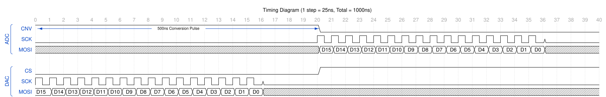

# Fast DAC and ADC Timing

To run this at 1MHz, we have 1000ns to do everything.

According to the datasheets:
- ADC conversion takes a max of 500ns
- DAC settling can take up to 1000ns (but should be smaller because of our small voltage changes)

This means:
- While we do ADC conversion, we don't want to change DAC voltage
- We want to give the DAC as much time as possible to settle

I think what makes the most sense:

ADC: Convert for 1st half of the µs, then read the value over SPI

DAC: transmit the data for the first µs, then trigger CS to load the data

We have something that looks like this:

The SPI clock here has to run at ~25ns clock period. This is because we have to have 16 clock periods in under 500ns.

25ns is 40MHz. We could get as low as 32MHz, but this might be cutting it a bit close.