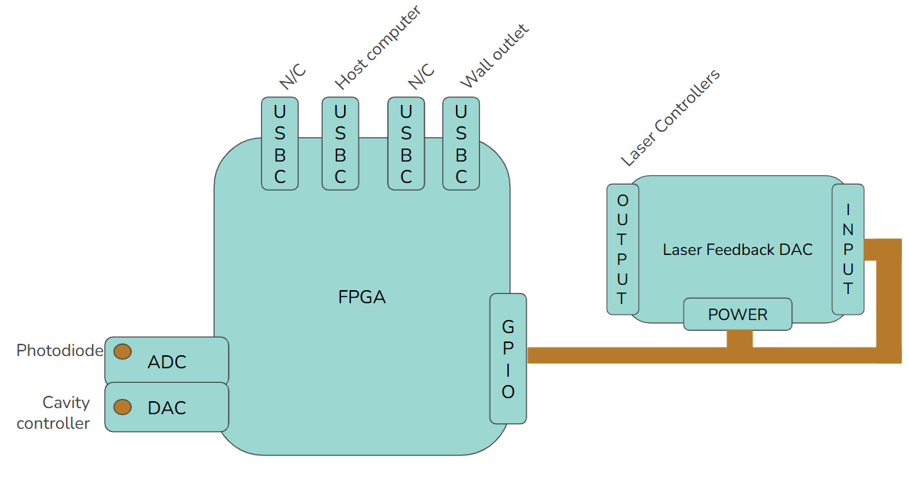
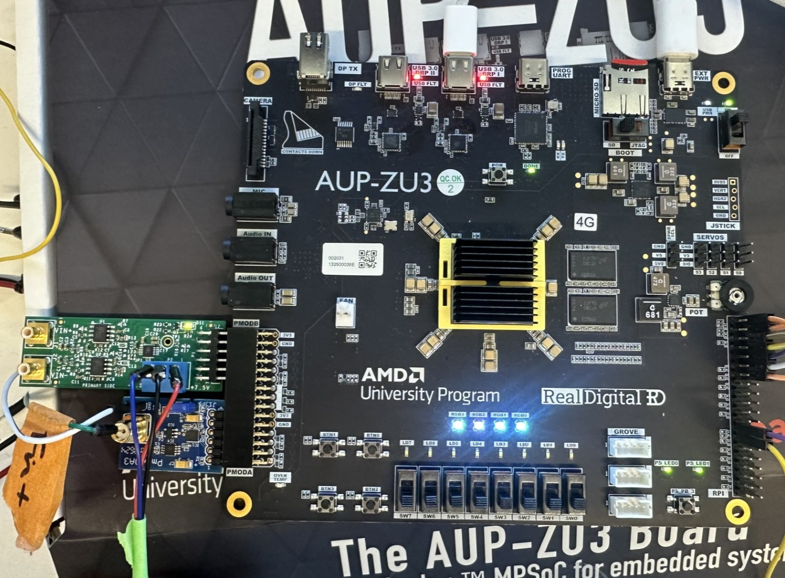
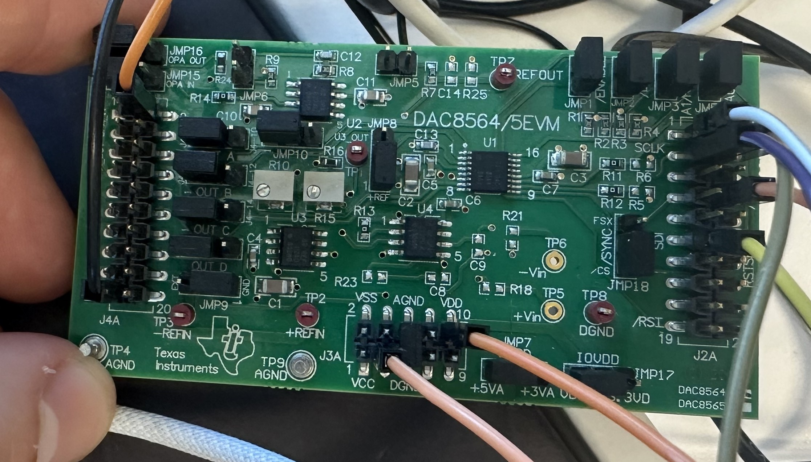

# Hardware Setup

## Bill of materials:

| Component           | Manufacturer      | Part Number      | Quantity | Cost     |
| ------------------- | ----------------- | ---------------- | -------- | -------- |
| FPGA                | RealDigital       | AUP-ZU3          | 1        | $160     |
| Laser Feedback DAC  | Texas Instruments | DAC8564EVM       | 1        | $50      |
| Cavity Width DAC    | Digilent          | PMOD DA3         | 1        | $36      |
| Laser Intensity ADC | Analog Devices    | EVAL-AD7983-PMDZ | 1        | $33      |
| **Total**           |                   |                  |          | **$279** |

## System overview: 

Notes: Photodiode should be plugged into top output of ADC (labelled Vin+). For the FPGA, power should be plugged into the right-most USB-C input (labelled EXT-PWR). The host computer should be plugged into middle USB-C input (labelled USB 3.0 DRP I). The SD Card should be flashed and programmed according to the setup guide attached with the board and should remain plugged in at all times. 

## Wiring

### ADC

### DAC

## Reference Images 

### FPGA 

Notes: The cavity width DAC should be plugged into PMOD A and the photodiode ADC should be plugged into PMOD B as shown in the image. 

### DAC

Notes: Input header is on the right side, power header is on the bottom, output header is on the left. Each laser controller output (1-4) is on output pins 2, 4, 6, and 8, respectively. Ground pins can be found on pins 9, 11, 13, 17, and 19 on the output header. Consult the schematic if additional ground pins are needed. All of the jumpers should be in the positions communicated by the above image- should be the default configuration that the board ships in.
