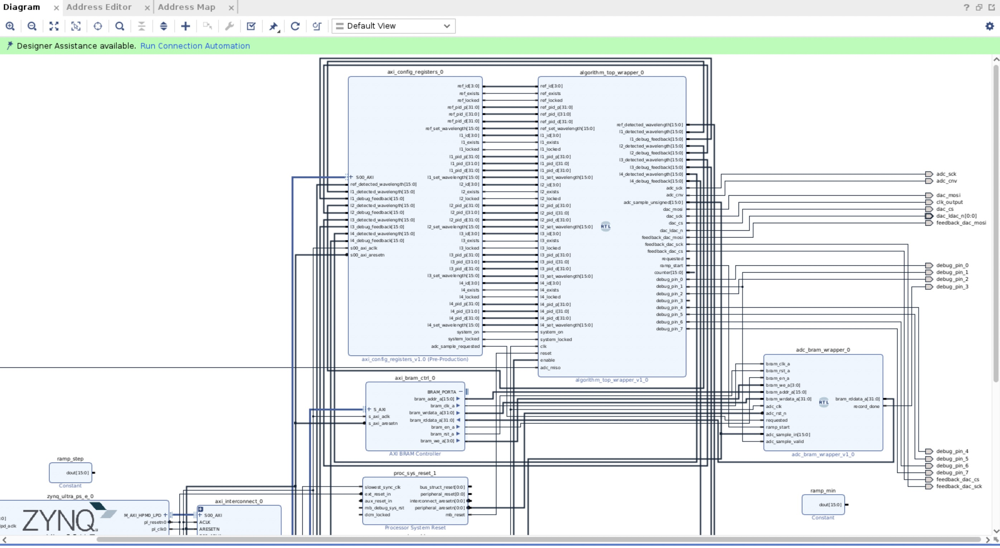

These are instructions specific to running Vivado on Tufts servers using our project.

# Using vivado on linux
We use Vivado On the Tufts homework server, run `use xilinx.2022` to get the `vivado` binary. Run `vivado PROJECT_NAME.xpr` to open the GUI.

# Our project

Our project root directory is `hardware/fpga/vivado`, so running `vivado hardware/fpga/vivado/vivado.xpr` will open our project.

## Project Structure
All of our RTL code is found in the `hardware/rtl/` directory. Most of our modules are instantiated under the `algorithm_top.sv`, which takes in a huge number of inputs from our block diagram. This allows us to use the block diagram as little as possible while still getting the benefits of adding Vivado IP using the GUI where needed.

Here is a screenshot of a subset of our block diagram:

At the top are the configuration registers defined in a Vivado custom IP (found at `hardware/ip_repo/axi_config_registers_1.0`), with all config registers wired as inputs into our `algorithm_top` module.

I/O for our peripherals are shown as pins on the block diagram, and their locations are mapped to pins in the `hardware/fpga/vivado/vivado.srcs/constrs_1/imports/aup_zu3/base.xdc` constraints file.

Other than that, we have our `adc_bram_wrapper` block that allows us to record whole cavity sweeps and expose that to the ARM core as a BRAM memory.

# Creating our project

Adapted from this: https://rfsoc.mit.edu/6S965/F24/assignments/week01/pynq_01

Download constraints file: https://github.com/Xilinx/AUP-ZU3/blob/main/base/constraints/base.xdc

Download board files: https://github.com/RealDigitalOrg/aup-zu3-bsp/tree/master (We have the 4GB model)
- you need to add your board files "repo" to Xilinx so it can find it: https://docs.amd.com/r/en-US/ug895-vivado-system-level-design-entry/Using-the-Vivado-Design-Suite-Platform-Board-Flow

Follow the project creation files from the original tutorial (substituting the constraint files, and using our AUP ZU3 4GB board)

# Helpful Resources
Most of this was figured out from the MIT class listed above: https://rfsoc.mit.edu/6S965/F24/

The PYNQ docs were also helpful: https://pynq.readthedocs.io/en/latest/.